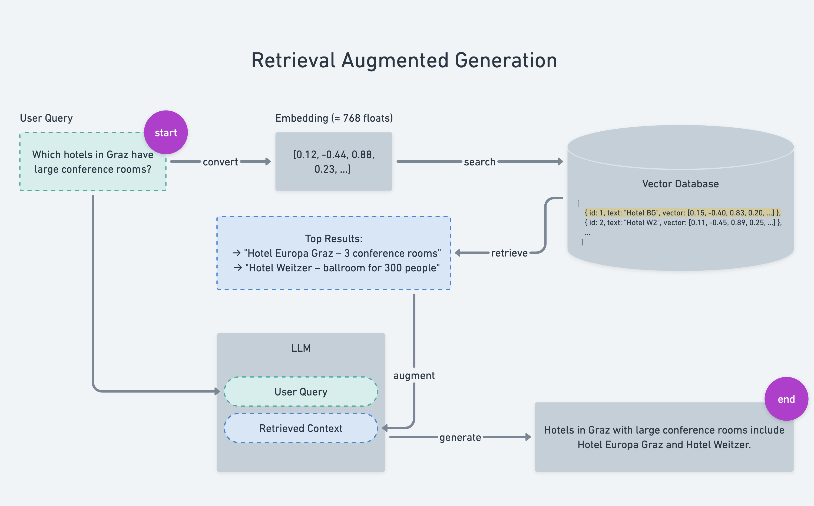

# RAG from Scratch

**Demystify Retrieval-Augmented Generation (RAG) by building it yourself - step by step.**  
No black boxes. No cloud APIs. Just clear explanations, simple examples, and local code you fully understand.

This project follows the same philosophy as [AI Agents from Scratch](https://github.com/pguso/ai-agents-from-scratch):  
make advanced AI concepts approachable for developers through minimal, well-explained, real code.

---

## What You'll Learn

- **What RAG really is**, and why it’s so powerful for knowledge retrieval.
- **How embeddings work**, turn text into numbers your model can understand.
- **How to build a local vector database**, store and query documents efficiently.
- **How to connect everything**, retrieve context and feed it into an LLM for grounded answers.
- **How to re-rank and normalize**, improving retrieval precision and reducing noise.
- **Step-by-step code walkthroughs**, every function explained, nothing hidden.

---

## Concept Overview

Retrieval-Augmented Generation (RAG) enhances language models by giving them access to **external knowledge**.  
Instead of asking the model to “remember” everything, you let it **retrieve relevant context** before generating a response.

**Pipeline:**
1. **Knowledge Requirements**, define questions and data needs.
2. **Data Loading**, import and structure your documents.
3. **Text Splitting & Chunking**, divide data into manageable pieces.
4. **Embedding**, turn chunks into numerical vectors.
5. **Vector Store**, save and index embeddings for fast retrieval.
6. **Retrieval**, fetch the most relevant context for a given query.
7. **Post-Retrieval Re-Ranking**, re-order results to prioritize the best context.
8. **Query Preprocessing & Embedding Normalization**, clean and standardize input vectors for consistency.
9. **Augmentation**, merge retrieved context into the model’s prompt.
10. **Generation**, produce grounded answers using a local LLM.

---

## Learning Path

Follow these examples in order to build understanding progressively:

### 0. **How RAG Works**
`examples/00_how_rag_works/`  
[Code](examples/00_how_rag_works/example.js) | [Code Explanation](examples/00_how_rag_works/CODE.md) | [Concepts](examples/00_how_rag_works/CONCEPT.md)

**What you'll learn:**
- The core idea behind Retrieval-Augmented Generation
- How retrieval and generation work together
- A minimal, simplified end-to-end RAG flow in under 70 lines of code

**Key concepts:** retrieval, generation, context injection, similarity search

---

### 1. **Data Loading**
`examples/02_data_loading/`  
[Code](examples/02_data_loading/example.js) | [Code Explanation](examples/02_data_loading/CODE.md) | [Concepts](examples/02_data_loading/CONCEPT.md)

**What you'll learn:**
- Loading raw text data
- Normalizing and preparing documents

**Key concepts:** file I/O, preprocessing, document structure

---

### 2. **Text Splitting & Chunking**
`examples/03_text_splitting_and_chunking/`  
[Code](examples/03_text_splitting_and_chunking/example.js) | [Code Explanation](examples/03_text_splitting_and_chunking/CODE.md) | [Concepts](examples/03_text_splitting_and_chunking/CONCEPT.md)

**What you'll learn:**
- How to split long text into manageable chunks
- Overlaps, boundaries, and chunk strategies

**Key concepts:** chunking logic, context windows, granularity trade-offs

---

### 3. **Embedding**
`examples/04_intro_to_embeddings/02_generate_embeddings/`  
[Code](examples/04_intro_to_embeddings/02_generate_embeddings/example.js) | [Code Explanation](examples/04_intro_to_embeddings/02_generate_embeddings/CODE.md) | [Concepts](examples/04_intro_to_embeddings/02_generate_embeddings/CONCEPT.md)

**What you'll learn:**
- How embeddings represent meaning as vectors
- How to generate embeddings locally

**Key concepts:** vector representation, similarity, embedding models

---

### 4. **Vector Store**
`examples/05_building_vector_store/01_in_memory_store/`  
[Code](examples/05_building_vector_store/01_in_memory_store/example.js) | [Code Explanation](examples/05_building_vector_store/01_in_memory_store/CODE.md) | [Concepts](examples/05_building_vector_store/01_in_memory_store/CONCEPT.md)

**What you'll learn:**
- How to store embeddings
- How nearest-neighbor search works

**Key concepts:** indexing, vector search, metadata storage

---

### 5. **Basic Retrieval**
`examples/06_retrieval_strategies/01_basic_retrieval/`  
[Code](examples/06_retrieval_strategies/01_basic_retrieval/example.js) | [Code Explanation](examples/06_retrieval_strategies/01_basic_retrieval/CODE.md) | [Concepts](examples/06_retrieval_strategies/01_basic_retrieval/CONCEPT.md)

**What you'll learn:**
- Retrieving relevant chunks from the vector store
- Understanding similarity scoring

**Key concepts:** augment, scoring, top-k retrieval

At the end you can look into [Showcase](examples/06_retrieval_strategies/01_basic_retrieval/showcase.js) to see everything you learned so far in action.

---

### 7. **Query Preprocessing**
`examples/06_retrieval_strategies/02_query_preprocessing/`  
[Code](examples/06_retrieval_strategies/02_query_preprocessing/example.js) | [Code Explanation](examples/06_retrieval_strategies/02_query_preprocessing/CODE.md) | [Concepts](examples/06_retrieval_strategies/02_query_preprocessing/CONCEPT.md)

**What you'll learn:**
- Cleaning and normalizing user queries before embedding
- Reducing noise and improving embedding consistency

**Key concepts:** normalization, stopword removal, query cleaning, vector stability

---

### 8. **Hybrid Search**
`examples/06_retrieval_strategies/03_hybrid_search/`  
[Code](examples/06_retrieval_strategies/03_hybrid_search/example.js) | [Code Explanation](examples/06_retrieval_strategies/03_hybrid_search/CODE.md) | [Concepts](examples/06_retrieval_strategies/03_hybrid_search/CONCEPT.md)

**What you'll learn:**
- Combining multiple retrieval strategies (e.g., vector + keyword)
- Balancing semantic similarity with traditional search signals

**Key concepts:** hybrid scoring, weighted search, BM25 + embeddings, multi-strategy retrieval

---

## Project Structure

```
├── src/                                    # Reusable library code
│   ├── embeddings/
│   │   ├── index.js                        # Main exports
│   │   ├── EmbeddingModel.js               # Model wrapper class
│   │   └── EmbeddingCache.js               # Caching layer
│   │
│   ├── vector-stores/
│   │   ├── index.js                        # Main exports
│   │   ├── BaseVectorStore.js              # Abstract base class
│   │   ├── InMemoryVectorStore.js          # In-memory implementation
│   │   ├── LanceDBVectorStore.js           # LanceDB implementation
│   │   └── QdrantVectorStore.js            # Qdrant implementation
│   │
│   ├── loaders/
│   │   ├── index.js
│   │   ├── BaseLoader.js                   # Abstract loader
│   │   ├── PDFLoader.js                    # PDF loading
│   │   ├── TextLoader.js                   # Text file loading
│   │   └── DirectoryLoader.js              # Batch loading
│   │
│   ├── text-splitters/
│   │   ├── index.js
│   │   ├── BaseTextSplitter.js             # Base class
│   │   ├── CharacterTextSplitter.js        
│   │   ├── RecursiveCharacterTextSplitter.js
│   │   └── TokenTextSplitter.js
│   │
│   ├── retrievers/
│   │   ├── index.js
│   │   ├── BaseRetriever.js                # Base retriever
│   │   ├── VectorStoreRetriever.js         # Vector search
│   │   ├── RerankerRetriever.js            # With reranking
│   │   └── HybridRetriever.js              # Multiple strategies
│   │
│   ├── chains/
│   │   ├── index.js
│   │   ├── RetrievalChain.js               # Query → Retrieve → Format
│   │   ├── RAGChain.js                     # Full RAG pipeline
│   │   └── ConversationalChain.js          # With memory
│   │
│   ├── prompts/
│   │   ├── index.js
│   │   ├── PromptTemplate.js               # Template class
│   │   └── templates/
│   │       ├── qa.js                       # Q&A templates
│   │       ├── summarization.js
│   │       └── conversation.js
│   │
│   ├── utils/
│   │   ├── index.js
│   │   ├── Document.js                     # Document class
│   │   ├── similarity.js                   # Similarity functions
│   │   ├── tokenizer.js                    # Token counting
│   │   └── validators.js                   # Input validation
│   │
│   └── index.js                            # Main library export
│
├── examples/
│   ├── 00_how_rag_works/
│   │   └── example.js                      # Minimal RAG simulation with naive keyword search
│   │
│   ├── 01_intro_to_llms/
│   │   └── example.js                      # Introduction to LLMs, the brain of your RAG system
│   │
│   ├── 02_data_loading/
│   │   └── example.js                      # Load and preprocess raw text data
│   │
│   ├── 03_text_splitting_and_chunking/
│   │   └── example.js                      # Split long text into chunks for embedding
│   │
│   ├── 04_intro_to_embeddings/
│   │   ├── 01_text_similarity_basics/
│   │   └── 02_generate_embeddings/
│   │
│   ├── 05_building_vector_store/
│   │   ├── 01_in_memory_store/
│   │   ├── 02_nearest_neighbor_search/
│   │   └── 03_metadata_filtering/
│   │
│   ├── 06_retrieval_strategies/
│   │   ├── 01_basic_retrieval/
│   │   ├── 02_query_preprocessing/
│   │   ├── 03_hybrid_search/
│   │   ├── 04_multi_query_retrieval/
│   │   ├── 05_query_rewriting/
│   │   ├── 06_rank_results/
│   │   └── 07_post_retrieval_reranking/
│   │
│   ├── 07_prompt_engineering_for_rag/
│   │   ├── 01_context_stuffing/
│   │   ├── 02_citation_prompts/
│   │   └── 03_context_compression/
│   │
│   ├── 08_rag_in_action/
│   │   ├── 01_basic_rag/
│   │   ├── 02_error_handling/
│   │   └── 03_streaming_responses/
│   │
│   ├── 09_evaluating_rag_quality/
│   │   ├── 01_retrieval_metrics/
│   │   ├── 02_generation_metrics/
│   │   └── 03_end_to_end_evaluation/
│   │
│   ├── 10_observability_and_caching/
│   │   └── example.js                      # Cache repeated queries and log performance
│   │
│   ├── 11_metadata_and_structured_data/
│   │   └── example.js
│   │
│   ├── 12_graph_db_integration/
│   │   └── example.js                      # Graph database using kuzu npm package
│   │
│   ├── 13_knowledge_requiremens/
│   │   └── example.js                      # Define what knowledge is needed and where it comes from
│   │
│   ├── tutorials/                          # Higher-level guides
│   │   ├── basic-rag-pipeline.js
│   │   ├── conversational-rag.js
│   │   ├── multi-modal-rag.js
│   │   └── advanced-retrieval.js
│   │
│   ├── templates/                          # Starter templates
│   │   ├── simple-rag/
│   │   ├── api-server/
│   │   └── chatbot/
│   │
│   ├── tests/                              # Unit tests
│   │   ├── embeddings/
│   │   ├── vector-stores/
│   │   └── ...
│   │
│   └── README.md
```

---

### How it works
| Goal                                | What You Add                                           | Why It Helps                                                      |
| ----------------------------------- |--------------------------------------------------------|-------------------------------------------------------------------|
| **Concept clarity**                 | `00_how_rag_works`                                     | See retrieval + generation in <70 lines before touching vectors.  |
| **Mathematical intuition**          | `04_intro_to_embeddings/01_text_similarity_basics.js`  | Learn cosine similarity without black-box APIs.                   |
| **Hands-on understanding**          | `05_building_vector_store/01_in_memory_store.js`       | Understand how embeddings are stored and compared.                |
| **Better results**                  | `06_retrieval_strategies/07_post_retrieval_reranking.js` | Reduce noise and redundancy in retrieved context.                 |
| **Query quality**                   | `06_retrieval_strategies/02_query_preprocessing.js`      | Ensure embeddings represent consistent meaning.                   |
| **Knowledge connectivity**          | `12_graph_db_integration/example.js`                   | Explore how a graph database can improve retrieval and reasoning. |

Each folder contains:
- A **minimal example** (`example.js`)
- A **detailed explanation** of every step
- Comments in the code to teach the concept clearly

---

## Current Implementation Status

This project is being built **step by step**, following an educational approach where each concept is introduced incrementally.

### ✅ What's Implemented

The following core components and examples are **currently available**:

**Examples & Tutorials:**
- ✅ `00_how_rag_works` - Minimal RAG simulation to understand the concept
- ✅ `01_intro_to_llms` - Getting started with local LLMs (node-llama-cpp basics, building LLM wrapper)
- ✅ `02_data_loading` - Loading and preprocessing raw text data
- ✅ `03_text_splitting_and_chunking` - Splitting long text into manageable chunks
- ✅ `04_intro_to_embeddings` - Text similarity basics and generating embeddings
- ✅ `05_building_vector_store` - In-memory store, nearest neighbor search, metadata filtering
- ✅ `06_retrieval_strategies` - Basic retrieval (partial implementation)

### 🚧 What's Coming Next

The following are **advanced topics** that will be added **step by step** in the coming **weeks and months**:

**Advanced Retrieval Strategies:**
- 🚧 Query preprocessing and normalization
- 🚧 Hybrid search combining multiple strategies
- 🚧 Multi-query retrieval
- 🚧 Query rewriting and expansion
- 🚧 Result ranking and scoring
- 🚧 Post-retrieval reranking

**Prompt Engineering for RAG:**
- 🚧 Context stuffing techniques
- 🚧 Citation and source attribution prompts
- 🚧 Context compression

**RAG in Production:**
- 🚧 Error handling and fallbacks
- 🚧 Streaming responses
- 🚧 End-to-end RAG pipeline examples

**Evaluation & Optimization:**
- 🚧 Retrieval metrics (precision, recall, MRR)
- 🚧 Generation quality metrics
- 🚧 End-to-end evaluation frameworks

**Advanced Features:**
- 🚧 Observability and performance monitoring
- 🚧 Caching strategies for repeated queries
- 🚧 Metadata and structured data handling
- 🚧 Graph database integration (using kuzu)
- 🚧 Multi-modal RAG

**Templates & Guides:**
- 🚧 Complete starter templates (simple RAG, API server, chatbot)
- 🚧 Higher-level tutorials and best practices

> **Note:** This is an educational project focused on building understanding from the ground up. Each new topic will be introduced with clear explanations, minimal examples, and thoroughly commented code. The goal is not to rush through features, but to ensure every concept is deeply understood before moving to the next.

---

## Requirements

- Node.js 18+
- Local LLM (e.g., `node-llama-cpp`)
- npm packages for embeddings, vector math, and optional `kuzu`

Install dependencies:

```bash
npm install
node 00_how_rag_works/example.js
```

## Philosophy

This repository is not about fancy frameworks or huge models.  
It’s about understanding, **line by line**, how RAG works under the hood.

If you can explain it, you can build it.  
If you can build it, you can improve it.

---

## Contribute

Contributions are welcome!  
If you have a clear, educational RAG example, open a PR.

---

## See Also

- [AI Agents from Scratch](https://github.com/pguso/ai-agents-from-scratch)
- [LangChain RAG Concepts](https://docs.langchain.com/oss/python/langchain/rag)
- [Best AI tools for RAG](https://codingscape.com/blog/best-ai-tools-for-retrieval-augmented-generation-rag)
