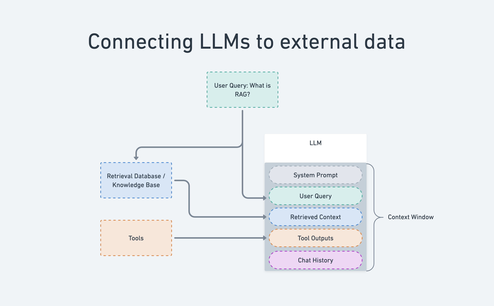

# Concepts: LLMs and node-llama-cpp

## What is a Large Language Model (LLM)?

A Large Language Model is an AI system trained on vast amounts of text data that can understand and generate human-like text. Think of it as a very sophisticated autocomplete system that has learned patterns in human language by reading millions of documents.

### How LLMs Work (Simplified)

Imagine you're texting someone and your phone suggests the next word. An LLM works the same way, but much more sophisticated:

**Training Phase (done once by AI companies):**
- The model reads millions of books, websites, and articles
- It learns patterns like: "The sky is usually..." → "blue"
- This takes weeks and massive computers
    
**When You Use It (inference):**
- You type: "Write a poem about cats"
- The model thinks: "After 'about cats' people usually write..."
- It picks one word at a time, building a response word by word
- Each word choice is based on what it learned during training

**Important limitation:** The model has a memory limit. After about a few pages of conversation, it starts forgetting the beginning (like trying to remember a long phone number).

### Key Characteristics

- **No Internet Access:** LLMs don't search the web; they generate text based on patterns learned during training
- **Knowledge Cutoff:** They only "know" information from their training data (up to a specific date)
- **Probabilistic:** Responses aren't deterministic - the same prompt can produce different outputs
- **Context Limited:** They can only work with a finite amount of text at once

## What is node-llama-cpp?

**node-llama-cpp** is a Node.js library that lets you run Large Language Models locally on your own computer, without needing internet access or cloud services.

### The Technology Stack

```
Your JavaScript Code
        ↓
node-llama-cpp (JavaScript bindings)
        ↓
llama.cpp (C++ inference engine)
        ↓
Your CPU/GPU (actual computation)
```

### What is llama.cpp?

**llama.cpp** is a highly optimized C++ implementation for running LLMs efficiently on consumer hardware. It's the engine that node-llama-cpp wraps.

**Key innovations:**
- Runs models in RAM (not requiring massive GPUs)
- Supports quantization (compressing models to smaller sizes)
- Works on CPUs, Apple Silicon, and NVIDIA/AMD GPUs
- Optimized for speed and efficiency

### What is GGUF?

**GGUF** (GPT-Generated Unified Format) is the file format used by llama.cpp to store model weights. It's designed to be:
- Efficient to load
- Easy to work with
- Extensible with metadata

**File naming example:** `model-name-7B.Q8_0.gguf`
- `7B` = 7 billion parameters (model size)
- `Q8_0` = quantization level (8-bit quantization, method 0)

## Why Use node-llama-cpp?

### Advantages

- **Privacy:** Your data never leaves your machine 
- **No API Costs:** Run unlimited inference for free (after downloading models)
- **Offline Capable:** Works without internet connection
- **Full Control:** Customize everything from temperature to context size
- **Fast Iteration:** No API rate limits when developing

### Trade-offs

- **Hardware Requirements:** Needs decent RAM (8GB+ for small models, 16GB+ for larger ones) 
- **Model Size:** Models are several gigabytes to download 
- **Speed:** Slower than cloud APIs (but faster than you might expect!) 
- **Quality:** Smaller local models are less capable than frontier models like GPT-4

## Key Concepts in node-llama-cpp

### Context Window

The "working memory" of the model - how much text it can consider at once.

- **Small (512-1024 tokens):** Short conversations, simple tasks
- **Medium (2048-4096 tokens):** Standard conversations, moderate documents
- **Large (8192+ tokens):** Long documents, extensive chat history

**Rule of thumb:** ~750 words = 1000 tokens

### Quantization

Compressing model weights to use less memory with minimal quality loss.

- **Q2-Q3:** Very compressed, noticeable quality loss
- **Q4-Q5:** Good balance of size and quality (most popular)
- **Q6-Q8:** Higher quality, larger files
- **F16/F32:** Full precision, largest files

### Temperature

Controls randomness in generation:

- **0.0-0.3:** Deterministic, focused, repetitive
- **0.7-0.8:** Balanced (default for most uses)
- **1.0-1.5:** Creative, diverse, potentially incoherent

### Batching

Processing multiple tokens in parallel for efficiency. Larger batch sizes are faster but use more memory.

## Common Use Cases

### What node-llama-cpp is Great For

- **Chatbots:** Personal assistants, customer service
- **Content Generation:** Writing, brainstorming, summarization
- **Code Assistance:** Code generation, explanation, debugging
- **Document Processing:** Summarization, Q&A over documents
- **Privacy-Sensitive Applications:** Healthcare, legal, personal data

### What to Use Cloud APIs For Instead

- **Frontier Performance:** When you need GPT-4 level quality
- **Scale:** Serving thousands of concurrent users
- **Multimodal:** Vision, audio (though local models are catching up)
- **Convenience:** No setup, maintenance, or hardware requirements

## Getting Started Checklist

1. **Hardware Check:** Do you have 8GB+ RAM?
2. **Download a Model:** Start with a 1-3B parameter model
3. **Install node-llama-cpp:** `npm install node-llama-cpp`
4. **Run Basic Example:** Verify everything works
5. **Experiment:** Try different models, temperatures, and prompts

## Model Selection Guide

### By Size (Parameter Count)

- **1B-3B:** Fast, runs on any modern computer, good for simple tasks
- **7B-8B:** Sweet spot for most applications, requires 8-16GB RAM
- **13B-15B:** Higher quality, requires 16-32GB RAM
- **30B+:** Best quality, requires 32GB+ RAM or GPU

### By Quantization

Start with **Q4_K_M** or **Q5_K_M** - they offer the best quality/size balance for most users.

## Resources

- **llama.cpp GitHub:** Original C++ implementation
- **Hugging Face:** Download GGUF models
- **node-llama-cpp Docs:** JavaScript API documentation
- **Local LLM Communities:** Reddit, Discord for support and model recommendations

## The Big Picture

Local LLMs are revolutionizing AI by making it accessible, private, and free to run. While they may not match the largest cloud models in raw capability, they're perfect for many real-world applications and getting better every month. node-llama-cpp makes this technology accessible to JavaScript developers with a simple, familiar API.