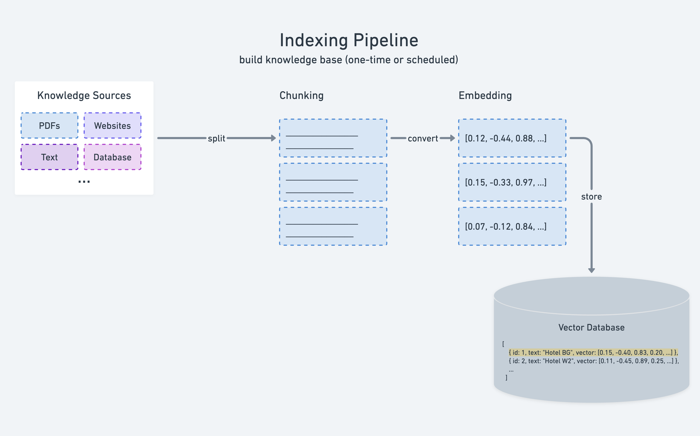

# Conceptual Guide: Document Loading for RAG Systems

## Table of Contents
1. [Introduction to Document Loading](#introduction-to-document-loading)
2. [The RAG Pipeline Context](#the-rag-pipeline-context)
3. [Core Concepts](#core-concepts)
4. [Document Structure](#document-structure)
5. [Text Extraction Strategies](#text-extraction-strategies)
6. [Text Preprocessing Philosophy](#text-preprocessing-philosophy)
7. [Page Splitting vs. Full Document](#page-splitting-vs-full-document)
8. [Comparison with LangChain.js](#comparison-with-langchainjs)
9. [Design Trade-offs](#design-trade-offs)
10. [When to Use What](#when-to-use-what)
11. [Advanced Concepts](#advanced-concepts)

---



Examples and how they map to the diagram
- 02_data_loading = Knowledge Sources <- you are here
- 03_text_splitting_and_chunking = Chunking
- 04_intro_to_embeddings = Embedding
- 05_building_vector_store = Vector Database

---

## Introduction to Document Loading

### What is Document Loading?

Document loading is the **first and foundational step** in any Retrieval-Augmented Generation (RAG) system. It's the process of taking unstructured data (PDFs, web pages, documents) and transforming them into a structured, machine-readable format that can be processed by downstream components in the RAG pipeline.

Think of it as the "intake system" of your RAG application - just as a restaurant needs to properly receive, inspect, and prepare ingredients before cooking, a RAG system needs to properly load and structure documents before they can be used to answer questions.

### Why Document Loading Matters

The quality of your document loading directly impacts:

1. **Retrieval Accuracy**: Poor text extraction leads to incomplete or corrupted content
2. **Embedding Quality**: Garbage in, garbage out-messy text creates poor embeddings
3. **Answer Quality**: LLMs can only work with what they're given
4. **Citation Accuracy**: Proper metadata enables precise source attribution
5. **System Performance**: Efficient loading affects the entire pipeline's speed

### The Challenge

PDFs and other documents contain:
- Visual formatting (bold, italics, columns)
- Non-textual elements (images, charts, tables)
- Structural artifacts (headers, footers, page numbers)
- Encoding complexities (fonts, character sets)
- Layout information (columns, text boxes)

Document loaders must extract meaningful text while handling these complexities intelligently.

---

## The RAG Pipeline Context

### Where Document Loading Fits

```
┌─────────────────────────────────────────────────────────────┐
│                     RAG PIPELINE                            │
├─────────────────────────────────────────────────────────────┤
│                                                             │
│  1. DOCUMENT LOADING                ← YOU ARE HERE          │
│     ├─ Load PDFs, docs, web pages                           │
│     ├─ Extract raw text                                     │
│     ├─ Clean and normalize                                  │
│     └─ Structure into Documents                             │
│                                                             │
│  2. TEXT SPLITTING                                          │
│     ├─ Break large documents into chunks                    │
│     ├─ Respect semantic boundaries                          │
│     └─ Add overlap for context                              │
│                                                             │
│  3. EMBEDDING GENERATION                                    │
│     ├─ Convert text chunks to vectors                       │
│     └─ Capture semantic meaning                             │
│                                                             │
│  4. VECTOR STORAGE                                          │
│     ├─ Index embeddings in vector DB                        │
│     └─ Store metadata for retrieval                         │
│                                                             │
│  5. RETRIEVAL (at query time)                               │
│     ├─ Embed user query                                     │
│     ├─ Find similar vectors                                 │
│     └─ Return relevant chunks                               │
│                                                             │
│  6. GENERATION                                              │
│     ├─ Combine query + retrieved context                    │
│     └─ Generate answer with LLM                             │
│                                                             │
└─────────────────────────────────────────────────────────────┘
```

### The Data Flow

```
PDF File → Document Loader → Structured Documents → Text Splitter → Chunks
                                      ↓
                              (with metadata)
                                      ↓
                          Eventually becomes context for LLM
```

---

## Core Concepts

### 1. Document Abstraction

A **Document** is a fundamental abstraction in RAG systems. It represents a unit of text with associated metadata:

```javascript
{
    pageContent: "The actual text content...",
    metadata: {
        source: "where it came from",
        page: "which page",
        // ... other contextual info
    }
}
```

**Why This Matters**:
- **Separation of Concerns**: Content is separate from metadata
- **Flexibility**: Same structure works for PDFs, web pages, CSVs, etc.
- **Traceability**: Always know where information originated
- **Filtering**: Can filter retrieval by metadata (e.g., "only search recent docs")

### 2. Unstructured → Structured Transformation

Document loading transforms:

```
UNSTRUCTURED               STRUCTURED
┌──────────────┐          ┌──────────────┐
│ Binary PDF   │          │ Document {   │
│ with complex │   →→→    │   text: "...",│
│ formatting   │          │   metadata   │
└──────────────┘          └──────────────┘
```

This transformation involves:
- **Parsing**: Understanding the file format
- **Extraction**: Pulling out text content
- **Cleaning**: Removing artifacts
- **Structuring**: Organizing into standard format

### 3. Metadata as First-Class Citizen

Metadata isn't just "extra info"-it's critical for:

#### Source Attribution

- User asks: “What does the paper say about RAG?”
- LLM can respond: “According to page 5 of the paper…”
- This is only possible because we stored page numbers!

#### Filtering and Routing

- “Search only in documents from 2024”
- “Find information in the Q3 reports”
- Metadata enables these queries

#### Debugging and Auditing

- “Where did this answer come from?”
- Metadata provides the trail back to the source


### 4. Granularity Decisions

**Granularity** refers to how finely you split documents:

```
COARSE GRANULARITY          FINE GRANULARITY
┌──────────────┐            ┌───┬───┬───┬───┐
│              │            │ P │ P │ P │ P │
│  Entire      │     vs.    │ a │ a │ a │ a │
│  Document    │            │ g │ g │ g │ g │
│              │            │ e │ e │ e │ e │
└──────────────┘            └───┴───┴───┴───┘
```

Trade-offs:
- **Coarse**: Better context, but less precise retrieval
- **Fine**: More precise, but may miss context

---

## Document Structure

### The Document Class Philosophy

```javascript
class Document {
    constructor(pageContent, metadata, id) {
        this.pageContent = pageContent;
        this.metadata = metadata;
        this.id = id;
    }
}
```

This simple structure embodies several design principles:

#### 1. Simplicity
- Three fields, clear purpose
- No unnecessary complexity
- Easy to understand and use

#### 2. Flexibility
- `pageContent` can be any text
- `metadata` is an open object (any structure)
- Works across document types

#### 3. Compatibility
- Matches LangChain's Document interface
- Interoperable with other RAG tools
- Standard pattern in the ecosystem

#### 4. Extensibility
- Easy to subclass for special document types
- Metadata can hold domain-specific information
- ID enables tracking and deduplication

### Metadata Schema Design

The metadata structure in our code:

```javascript
{
    source: "URL or file path",           // Origin
    pdf: {
        info: {...},                       // PDF properties
        metadata: {...},                   // PDF metadata
        totalPages: 22                       // Total pages
    },
    loc: {                                 // Location
        pageNumber: 1                      // Specific page
    }
}
```

**Design Considerations**:

**Hierarchical Organization**:
- Groups related metadata together
- `pdf` contains all PDF-specific info
- Easy to extend for other formats (add `word: {...}`)

**Balance Between Generic and Specific**:
- `source` and `loc` are generic (work for any document)
- `pdf` is format-specific (only for PDFs)

**Future-Proofing**:
- Can add new top-level keys without breaking existing code
- Nested structure allows deep customization

---

## Text Extraction Strategies

### The Challenge of PDF Text Extraction

PDFs are fundamentally **visual documents**-they specify where ink should appear on a page, not the logical structure of text. This creates challenges:

#### Problem 1: Text Order Ambiguity

```
┌─────────────────────────────┐
│  PDF Visual Layout:         │
│                             │
│  ┌──────────┐  ┌──────────┐ │
│  │ Column 1 │  │ Column 2 │ │
│  │ Text A   │  │ Text C   │ │
│  │ Text B   │  │ Text D   │ │
│  └──────────┘  └──────────┘ │
└─────────────────────────────┘

Possible Extractions:
1. "Text A, Text B, Text C, Text D" (column-by-column)
2. "Text A, Text C, Text B, Text D" (left-to-right, top-to-bottom)
```

#### Problem 2: Artifact Pollution

PDFs contain visual elements that shouldn't be in the extracted text:
- Page numbers ("Page 1 of 22")
- Headers and footers
- Watermarks
- Decorative elements

#### Problem 3: Encoding Issues

- Different fonts may encode characters differently
- Special characters (bullets, em-dashes) may not extract cleanly
- Unicode normalization issues

### Extraction Philosophy

Our code uses **pdf-parse**, which:
- Extracts text in reading order (best effort)
- Handles common encoding issues
- Provides page-level extraction

The philosophy is:
1. **Extract first, clean later**: Get all text out, then process it
2. **Preserve semantic structure**: Keep paragraph breaks
3. **Remove noise**: Strip out pagination artifacts
4. **Normalize**: Create consistent formatting

---

## Text Preprocessing Philosophy

### Why Clean Text?

Raw PDF text often looks like:

```
"Retrieval-Augmented    Generation  for


AI-Generated Content

-- 1 of 22 --


Abstract:    This paper surveys..."
```

After cleaning:

```
"Retrieval-Augmented Generation for
AI-Generated Content

Abstract: This paper surveys..."
```

### The Cleaning Pipeline

Our `cleanText` function implements a **three-stage cleaning pipeline**:

#### Stage 1: Artifact Removal
```javascript
.replace(/[-–-]\s*\d+\s*of\s*\d+\s*[-–-]/gi, '')
```

**Purpose**: Remove pagination artifacts that add no semantic value

**Philosophy**: These elements are *navigation aids* for human readers viewing the PDF, but they're noise for machine processing. They:
- Don't contribute to meaning
- Break up sentences artificially
- Consume tokens needlessly
- Confuse embedding models

**Example**:
```
Before: "The study found -- 5 of 12 -- significant results"
After:  "The study found significant results"
```

#### Stage 2: Whitespace Normalization
```javascript
.replace(/[ \t]+/g, ' ')
```

**Purpose**: Create consistent spacing

**Philosophy**: Multiple spaces and tabs are artifacts of PDF rendering. They don't carry semantic meaning in plain text. Normalization:
- Makes text predictable
- Reduces token count
- Improves embedding consistency
- Simplifies downstream processing

**Example**:
```
Before: "The    results     showed	significant"
After:  "The results showed significant"
```

#### Stage 3: Paragraph Preservation
```javascript
.replace(/\n{3,}/g, '\n\n')
```

**Purpose**: Maintain document structure while removing excess

**Philosophy**: This is the most subtle but important step. It balances two competing needs:

1. **Preserve Structure**: Paragraph breaks carry semantic meaning (topic changes, logical divisions)
2. **Remove Noise**: Multiple blank lines are rendering artifacts

**Why Two Newlines?**:
- Standard convention: `\n\n` = paragraph break
- One newline = line break (within paragraph)
- Two newlines = paragraph boundary
- Three+ newlines = rendering artifact

**Example**:
```
Before:
"First paragraph.


Second paragraph."

After:
"First paragraph.

Second paragraph."
```

### The Philosophy of Conservative Cleaning

Notice what our cleaning **doesn't** do:
- ❌ Remove punctuation
- ❌ Lowercase everything
- ❌ Remove stop words
- ❌ Lemmatize or stem
- ❌ Fix spelling errors

**Why?** Because:
1. Modern embedding models handle these variations
2. Preserves original meaning and author's voice
3. Maintains proper nouns and technical terms
4. Reduces risk of introducing errors
5. Keeps citations accurate

This is **conservative preprocessing**-remove obvious noise, preserve meaning.

---

## Page Splitting vs. Full Document

### The Core Trade-off

This is one of the most important conceptual decisions in document loading:

```
┌────────────────────────────────────────────────────────┐
│                 GRANULARITY SPECTRUM                   │
├────────────────────────────────────────────────────────┤
│                                                        │
│  Full Document          Pages           Paragraphs     │
│  ─────────────          ─────           ───────────    │
│  • Best context         • Balanced      • Best         │
│  • Worst precision      • Citations     • Precision    │
│  • Simple               • Flexible      • Complex      │
│                                                        │
└────────────────────────────────────────────────────────┘
```

### Full Document Mode (`splitPages: false`)

**Concept**: Treat the entire PDF as a single, monolithic document.

**When to Use**:
- Short documents (< 10 pages)
- Highly cohesive content (single topic throughout)
- When you'll be doing your own custom chunking later
- Simple use cases

**Advantages**:
```
✓ Maximum context preservation
✓ No artificial boundaries
✓ Simpler data structure (1 document)
✓ Faster processing (single extraction)
✓ Good for whole-document questions
```

**Disadvantages**:
```
✗ May exceed embedding model token limits
✗ Less precise retrieval
✗ No page-level citations
✗ Harder to identify relevant sections
✗ Memory intensive for large documents
```

**Example Use Case**:
```
Document: A 5-page company policy on remote work
Strategy: Load as single document
Reason: Short, cohesive, users need full context
```

### Page Splitting Mode (`splitPages: true`)

**Concept**: Create one document per page, each with its own metadata.

**When to Use**:
- Long documents (> 10 pages)
- Academic papers (citations matter)
- Technical manuals (specific page references)
- When you need granular retrieval

**Advantages**:
```
✓ Precise page-level citations
✓ Manageable chunk sizes
✓ Better retrieval granularity
✓ Parallel processing possible
✓ Respects natural boundaries
```

**Disadvantages**:
```
✗ Context may split across pages
✗ More documents to manage
✗ Slightly slower processing
✗ Need good chunking strategy later
```

**Example Use Case**:
```
Document: 50-page research paper
Strategy: Split by pages
Reason: Need citations, paper is long, topics vary by section
```

### The Middle Ground

In practice, pages are often still too large for optimal retrieval. The typical workflow is:

```
PDF → Load by Pages → Further Split into Chunks → Embed

Example:
1. Load: 50-page PDF → 50 page-documents
2. Split: Each page → 2-4 chunks (semantic boundaries)
3. Result: ~150 chunks, each with page number metadata
```

This gives you:
- The best of both worlds
- Page-level attribution
- Chunk-level precision
- Context preservation through overlap

---

## Comparison with LangChain.js

### Overview

LangChain.js is the leading framework for building LLM applications, including RAG systems. Let's compare our custom implementation with LangChain's approach.

### Document Loaders in LangChain

LangChain provides a rich ecosystem of document loaders:

```javascript
import { PDFLoader } from "langchain/document-loaders/fs/pdf";
import { WebPDFLoader } from "langchain/document-loaders/web/pdf";

// URL-based loading
const loader = new WebPDFLoader("https://example.com/paper.pdf");

// File-based loading
const loader = new PDFLoader("./path/to/file.pdf");

// Load documents
const docs = await loader.load();
```

### Architectural Comparison

#### Our Implementation

```javascript
// Custom, explicit
const extractTextFromPDF = async (url, {splitPages} = {splitPages: false}) => {
    const parser = new PDFParse({url});
    // ... manual processing
    return doc;
}
```

**Philosophy**:
- **Explicit control** over every step
- **Transparency** in what happens to the text
- **Customization** is straightforward
- **Learning-focused** (understand the process)

#### LangChain.js

```javascript
// Abstracted, declarative
const loader = new WebPDFLoader(url, {
    splitPages: true,
    pdfjs: () => import("pdf-parse")
});
const docs = await loader.load();
```

**Philosophy**:
- **Abstraction** hides complexity
- **Consistency** across different loaders
- **Batteries included** with smart defaults
- **Production-focused** (get results fast)

### Feature Comparison Table

| Feature | Our Implementation  | LangChain.js |
|---------|---------------------|--------------|
| **Learning Curve** | Low (simple, clear) | Medium (framework concepts) |
| **Flexibility** | High (full control) | Medium (within framework) |
| **Setup Complexity** | Low (one file)      | Medium (dependencies) |
| **Text Cleaning** | Custom, explicit    | Built-in, opinionated |
| **Error Handling** | Manual              | Automatic |
| **Multiple Formats** | Need custom code    | 80+ loaders available |
| **Integration** | Custom pipeline     | Seamless with LangChain |
| **Production Ready** | Need hardening      | Yes |
| **Documentation** | Basic               | Extensive |
| **Community** | DIY                 | Large ecosystem |

### Detailed Feature Analysis

#### 1. Document Structure

**Our Implementation**:
```javascript
class Document {
    constructor(pageContent, metadata, id) {
        this.pageContent = pageContent;
        this.metadata = metadata;
        this.id = id;
    }
}
```
- Simple, straightforward
- Easy to understand
- Compatible with LangChain (same interface!)

**LangChain**:
```javascript
import { Document } from "langchain/document";

// Same structure, but with additional methods
const doc = new Document({
    pageContent: "...",
    metadata: {...}
});
```
- More features (serialization, etc.)
- Part of larger ecosystem
- Typed (TypeScript definitions)

#### 2. Text Cleaning

**Our Implementation**:
```javascript
const cleanText = (text) => {
    return text
        .replace(/[-–-]\s*\d+\s*of\s*\d+\s*[-–-]/gi, '')
        .replace(/[ \t]+/g, ' ')
        .replace(/\n{3,}/g, '\n\n')
        .trim();
}
```
- **Explicit**: You see exactly what's happening
- **Customizable**: Easy to add/remove cleaning steps
- **Transparent**: No hidden transformations

**LangChain**:
```javascript
// Cleaning is often handled internally by loaders
// Can customize via TextSplitter configuration
const splitter = new RecursiveCharacterTextSplitter({
    chunkSize: 1000,
    chunkOverlap: 200,
    // Cleaning happens automatically
});
```
- **Automatic**: Cleaning is built-in
- **Opinionated**: Uses framework's defaults
- **Hidden**: Less visibility into process

#### 3. Page Splitting

**Our Implementation**:
```javascript
if (splitPages) {
    for (let i = 0; i < pages; i++) {
        const rawText = (await parser.getText({partial: [i + 1]})).text;
        // ... create page-level document
    }
}
```
- **Manual loop**: Explicit page-by-page processing
- **Direct control**: Decide exactly how pages are handled
- **Visible logic**: Easy to debug

**LangChain**:
```javascript
const loader = new WebPDFLoader(url, {
    splitPages: true  // That's it!
});
```
- **Declarative**: Just specify what you want
- **Handled internally**: Framework does the work
- **Consistent**: Same API across loaders

#### 4. Metadata Handling

**Our Implementation**:
```javascript
{
    source: url,
    pdf: {
        info: info,
        metadata: info.metadata,
        totalPages: pages,
    },
    loc: {
        pageNumber: i + 1
    }
}
```
- **Custom structure**: Design your own metadata schema
- **Explicit construction**: You control what's stored
- **Full flexibility**: Add any metadata you need

**LangChain**:
```javascript
// Metadata is automatically populated
{
    source: "https://example.com/paper.pdf",
    pdf: {
        version: "1.4",
        info: {...},
        metadata: {...},
        totalPages: 50
    },
    loc: { pageNumber: 1 }
}
```
- **Standardized**: Consistent across loaders
- **Automatic**: No manual construction needed
- **Rich**: Includes many useful fields by default

---

## Conclusion

### Key Takeaways

1. **Document loading is foundational**: Quality here affects everything downstream

2. **Simple is often better**: Our implementation proves you don't need complexity for effectiveness

3. **Understand the trade-offs**: Every design decision has pros and cons

4. **Start simple, evolve**: Begin with basic loading, add sophistication as needed

5. **Choose the right tool**: Custom for learning, LangChain for production, hybrid for special needs

### The Journey

```
Phase 1: Learn the concepts (custom implementation)
    ↓
Phase 2: Understand the challenges (hit edge cases)
    ↓
Phase 3: Appreciate the frameworks (see why they exist)
    ↓
Phase 4: Make informed decisions (custom vs. framework)
```

### Further Exploration

To deepen your understanding:

1. **Experiment**: Try different cleaning strategies, compare results
2. **Measure**: Add metrics, see what affects quality
3. **Compare**: Load same document with custom code and LangChain
4. **Extend**: Add table extraction, image handling
5. **Scale**: Try loading 100 documents, measure performance

### Final Thoughts

Document loading is where data engineering meets information retrieval. It's:
- Part science (algorithms, strategies)
- Part art (knowing what to preserve)
- Part craft (implementation quality)

Our simple implementation teaches the fundamentals. LangChain provides production power. Understanding both makes you a better RAG engineer.

The best RAG systems don't just load documents-they **curate knowledge**. And that starts here, at the very first step, with thoughtful, principled document loading.